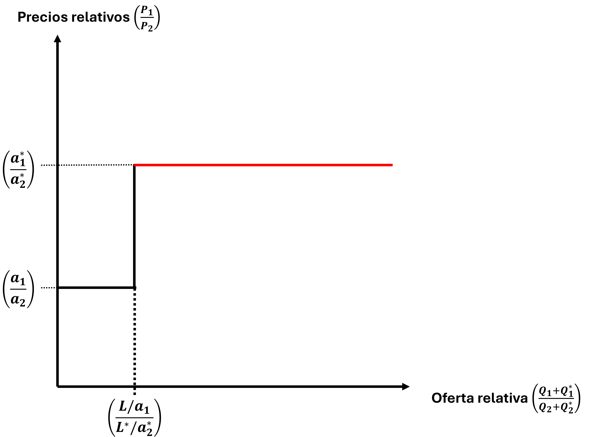
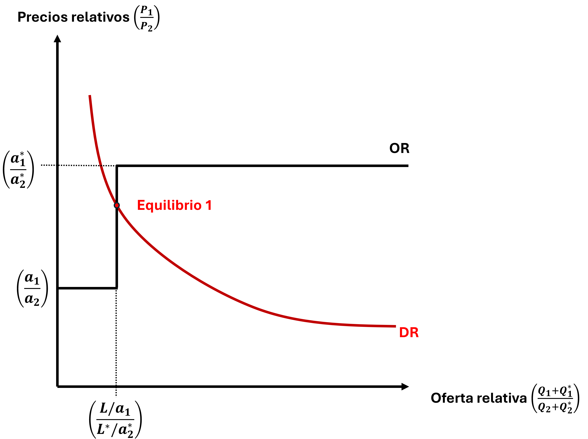
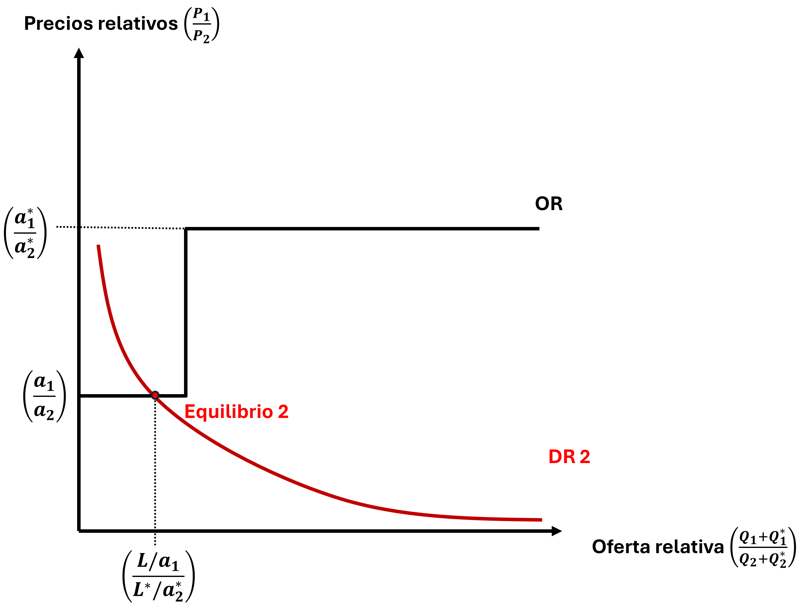
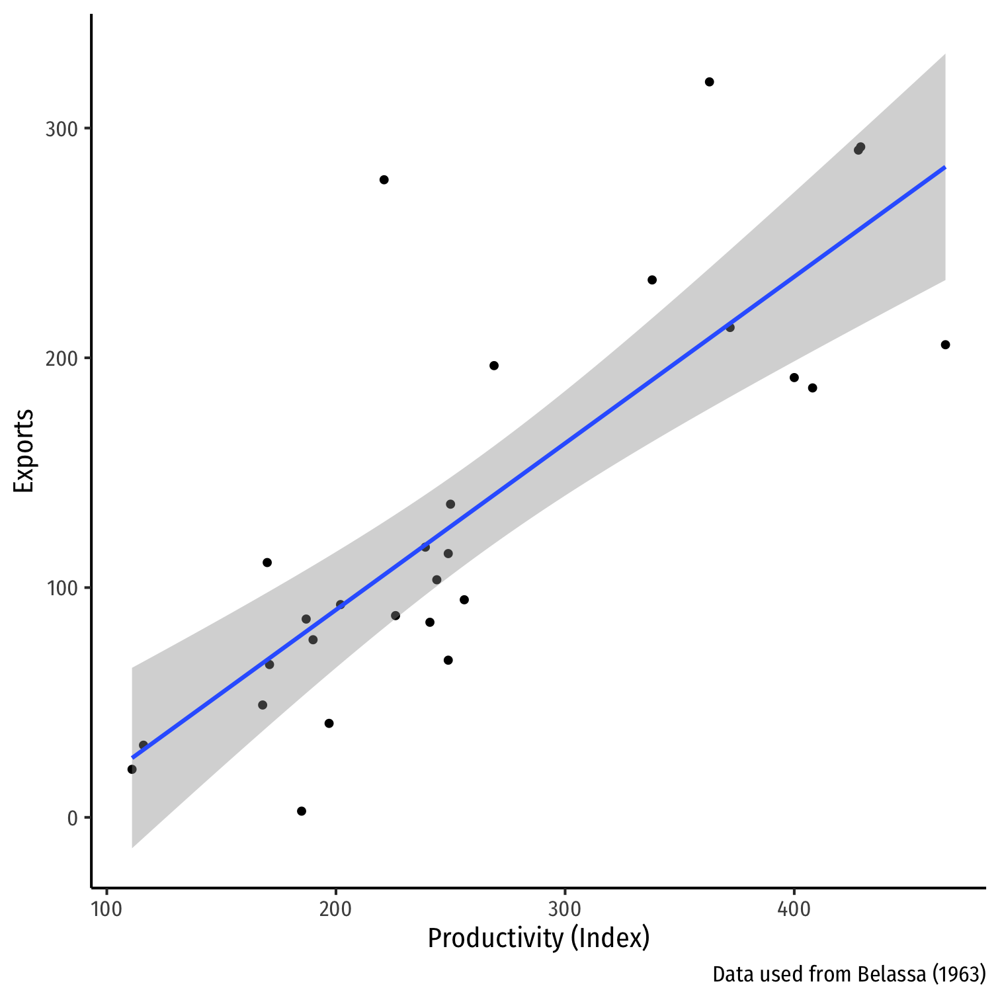
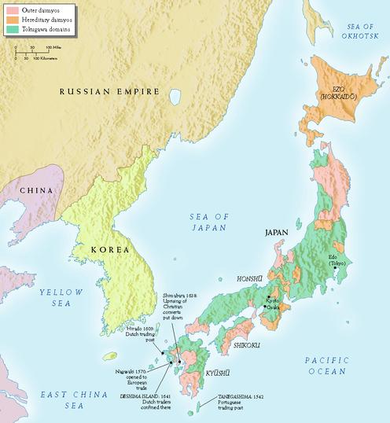
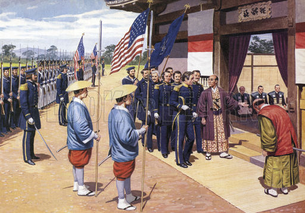
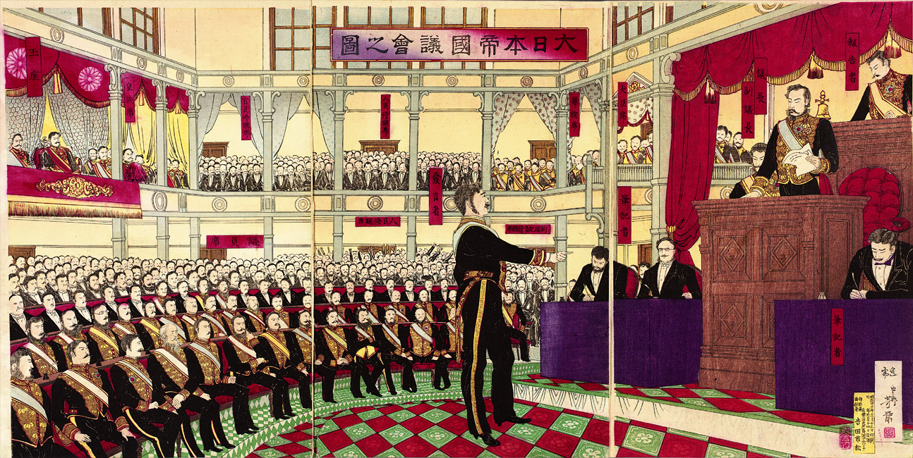
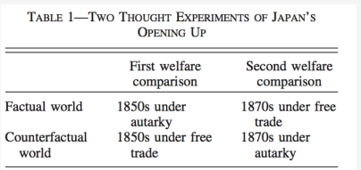

class: inverse, middle

```{r Setup, include = F}
options(htmltools.dir.version = FALSE)
library(pacman)
p_load(ggthemes, viridis, knitr, dslabs, gapminder, extrafont, Ecdat, wooldridge, tidyverse, magrittr)
#devtools::install_github("R-CoderDotCom/econocharts")

library(econocharts)
# Define colors
red_pink <- "#e64173"
met_slate <- "#272822" 
turquoise <- "#20B2AA"
orange <- "#FFA500"
red <- "#fb6107"
blue <- "#2b59c3"
green <- "#8bb174"
grey_light <- "grey70"
grey_mid <- "grey50"
grey_dark <- "grey20"
purple <- "#6A5ACD"
slate <- "#314f4f"
# Notes directory
dir_slides <- "~/Semana 1/01-Intro"
# Knitr options
opts_chunk$set(
  comment = "#>",
  fig.align = "center",
  fig.height = 7,
  fig.width = 10.5,
  warning = F,
  message = F
)  
opts_chunk$set(dev = "svg")
options(device = function(file, width, height) {
  svg(tempfile(), width = width, height = height)
})
options(crayon.enabled = F)
options(knitr.table.format = "html")
```

```{css, echo = F, eval = F}
@media print {
  .has-continuation {
    display: block !important;
  }
}
```

# Prólogo 
---
# Recapitulando

**¿Qué hemos hecho hasta ahora?**

* Hacer un análisis gráfico del comercio a partir de la ventaja comparativa. 

* Formalizar el modelo y desarrollar la definición precisa de un equilibrio en el modelo. 

* Resolver el modelo en .hi-pink[autarquía]


--


**¿Para dónde vamos?**

* Resolver el modelo con comercio. 

* Volver al análisis gráfico y comparar los resultados con nuestro modelo formalizado. 

* Comenzar a desarrollar análisis de política desde nuestro modelo. 


---

# Ley de Walras

> En los modelos de equilibrio general, si todas menos una de las ecuaciones de equilibrio se mantiene, entonces la última ecuación estará en equilibrio automáticamente.


--

* Hemos empleado la Ley de Walras para solucionar el equilibrio de autarquía. No hemos utilizado la condición de vaciado del mercado de trabajo. 

* Esto siginfica que tenemos una ecuación de equilibrio menos de la que pensamos (se mantiene en equilibrio automáticamente).

* También tenemos una incognita de equilibrio menos (variable endógena). Solo nos interesan los precios relativos para definir las asignaciones. 

* En la práctica, normalizamos los salarios a 1, pero no importa que precio normalicemos o a que valor lo fijemos. 

* .red[Nota: Es un error comun que cuando ponemos nuestros modelos en una computadora olvidemos el principio de la Ley de Walras]


---

class: inverse, middle

.bigger[.center[.white[**Solución del modelo en equilibrio: <br> Libre comercio**]]]

---
# Equilibrio de libre comercio

Para resolver el modelo con libre comercio debemos hacer modificaciones a las condiciones de vaciado de los mercados. 

Existen múltiples resultados potenciales: un país se especializa o ambos se especializan.

* Podemos hacer dos supuestos para simplificar el modelo: 

1. Supongamos que $a_{1}^{D}/a_{2}^{D}<a_{1}^{E}/a_{2}{E}$. Esto implica que el país .blue[Doméstico] tiene ventaja comparativa en el **Bien 1**.

2. Supongamos que existe la especialización completa en el equilibrio. 
  - Existen varios escenarios que examinaremos rápidamente en la siguientes diapositivas. 

---
# Escenarios de libre comercio

Antes de que suceda el comercio, los precios relativos reflejan el .hi-pink[costo de oportunidad] de producir un bien en cada país. 

* Para conocer los beneficios del comercio, necesitamos encontrar los precios relativos cuando existe el comercio. 

* Primero, calculamos la  curva de .hi-pink[oferta relativa mundial] del Bien .red[**x**]: es decir, la cantidad del **Bien X** ofertada por todos los países relativo a la cantidad ofrecida del **Bien Y**. 

$$ \color{red}{RS = \frac{(Q_x^D +Q_x^E)}{Q_y^D+Q_y^E}}$$
---

class: inverse, middle

.bigger[.center[.white[**Derivación del equilibrio: <br> Curvas de oferta y demanda relativa**]]]


---

# Derivación de curva de oferta relativa 

```{r, out.width="60%", echo=FALSE}


```

Supongamos que $\color{red}{\left(\frac{a_1^D}{a_2^D}\right)<\left(\frac{a_1^E}{a_2^D}\right)}$. Así, el país .blue[Doméstico] tiene ventaja comparativa en el **Bien 1**. <br> (El Bien 1 tiene un costo de oportunidad menor en términos del Bien 2 en el país Doméstico en comparación con el Extranjero).

---
# Derivación de curva de oferta relativa

```{r, out.width="60%", echo=FALSE}


```
**Caso 1**: $\color{red}{\left(\frac{p_1}{p_2}\right)< \left(\frac{a_1^D}{a_2^D}\right) < \left(\frac{a_1^E}{a_2^E}\right)} \implies$ .red[Ninguno de los países producirá el **Bien 1**] <br>
$$ \color{red}{RS = \frac{(0 + 0 )}{Q_y^D+Q_y^E}} = 0, \text{  donde  } Q_2^D=\frac{L^D}{a_2^D} \text{  y } Q_2^E=\frac{L^E}{a_2^E}$$


---
# Derivación de curva de oferta relativa

```{r, out.width="55%", echo=FALSE}


```

**Caso 2**: $\color{red}{\left(\frac{p_1}{p_2}\right) = \left(\frac{a_1^D}{a_2^D}\right) < \left(\frac{a_1^E}{a_2^E}\right)} \implies$ .red[El país Doméstico es indiferente entre producir el Bien 1 y el Bien 2] <br>
$$ \color{red}{RS = \frac{(0 + 0 )}{Q_y^D+Q_y^E}} = 0, \text{  donde  } Q_1^D\in \left[0, \frac{L^D}{a_1^D}\right] \text{  ; } Q_2^E=\frac{L^D-a_1^DQ_1^D}{a_2^D} \text{  y  } Q_2^E= \frac{L^E}{a_2^E}$$
---

# Derivación de curva de oferta relativa

```{r, out.width="55%", echo=FALSE}


```
**Caso 3**: $\color{red}{\left(\frac{a_1^D}{a_2^D}\right) < \left(\frac{p_1}{p_2}\right)} < \left(\frac{a_1^E}{a_2^E}\right) \implies$ .red[El país Doméstico produce solamente el Bien 1. El país Extranjero produce únicamente el Bien 2]. <br>

$$RS = \left(\frac{Q_1^D+0}{0+Q_2^D}\right) \text{  donde  } Q_1^D=\frac{L^D}{a_1^D} \text{   y  } Q_2^E = \frac{L^D}{a_2^E}$$
---

# Derivación de curva de oferta relativa

```{r, out.width="55%", echo=FALSE}



```
**Caso 4**: $\left(\frac{a_1^D}{a_2^D}\right) <\left(\frac{a_1^E}{a_2^E}\right) \color{red}{=\left(\frac{p_1}{p_2}\right)} \implies$ .red[El país Extranjero es indiferente entre producir ambos bienes] <br>

$$RS = \left(\frac{Q_1^D+Q_1^E}{0+Q_2^E}\right) , \text{  donde } Q_1^D=\frac{L^D}{a_1^D} \text{  y } Q_2^E\in \left[0, \frac{L^E}{a_2^E}\right]; Q_1^E=\frac{L^E-a_2^EQ_2^E}{a_1^E} $$


---

# Derivación de curva de oferta relativa

```{r, out.width="55%", echo=FALSE}


```
**Caso 5**: $\left(\frac{a_1^D}{a_2^D}\right) <\left(\frac{a_1^E}{a_2^E}\right) \color{red}{<\left(\frac{p_1}{p_2}\right)} \implies$ .red[Ninguno de los países producirá el Bien 2] <br>

$$RS = \left(\frac{Q_1^D+Q_1^E}{0+0}\right) = \infty , \text{  donde } Q_1^D=\frac{L^D}{a_1^D} \text{  y } Q_1^E=\frac{L^E}{a_1^E} $$


---
# Equilibrio y Demanda Relativa

```{r, out.width="55%", echo=FALSE}



```
Encontramos el equilibrio cuando $OR=DR$. Esto sucede en el punto .red[Equilibrio 1]. <br>

Por lo tanto, $\left(\frac{a_1^D}{a_2^D}\right) \color{red}{<\left(\frac{p_1}{p_2}\right) < \left(\frac{a_1^E}{a_2^E}\right)} \implies$ .red[El país Doméstico solo produce el Bien 1. El país Extranjero solo produce el Bien 2]


---

# Equilibrio y Demanda Relativa

```{r, out.width="55%", echo=FALSE}



```
Diferentes curvas de DR conllevan diferentes equilibrios. La nueva curva de DR intersecta la OR en el .red[Equilibrio 2] $\implies \color{red}{\left(\frac{p_1}{p_2}\right)=\left(\frac{a_1^D}{a_2^D}\right) < \left(\frac{a_1^E}{a_2^E}\right)} \implies$ .red[El país Doméstico es indiferente entre producir ambos bienes. El país Extranjero solo produce el Bien 2]

---

# Demanda relativa (Equilibrio)

```{r, out.width="60%", echo=FALSE}


```
* Resolvemos el modelo suponiendo que un patrón de especialización completa de los países. Ambos se especializan en un solo producto e intercambian. 

* Más adelante podemos revisar si el supuesto es válido. 

---

# Demanda relativa (Equilibrio)

```{r, out.width="60%", echo=FALSE}


```
* En este nuevo equilibrio, el país .blue[Doméstico] produce ambos bienes y el país .red[Extranjero] solo produce el bien 2. .hi-pink[No es una solución de equilibrio válida] ¿Por qué? 🤷🏽‍♀️ 

* Siendo rigurosos debemos resolver todos los posibles escenarios de especialización. 


---
# Definición de equilibrio 

En el equilibrio encontramos el conjunto de precios $\{p_1,p_2\}$, salarios $\{w_1, w_2\}$ y las asignaciones de consumo y produccion domésticas y extranjeras $\{c_1^{i}, c_2^{i}, y_{1}^{i}, y_{2}^{i}\}_{i \in [D,E]}$, sujetos a: 

1. Los consumidores maximizan su utilidad. 

2. Las empresas maximizan sus beneficios. 

3. Los mercados se vacían. 


**Incognitas de equilibrio**: precios $\{p_1,p_2\}$, salarios $\{w_1, w_2\}$ y las asignaciones de consumo y produccion domésticas y extranjeras $\{c_1^{i}, c_2^{i}, y_{1}^{i}, y_{2}^{i}\}_{i \in [D,E]}$


---

# Ecuaciones de equilibrio

* La optimización del consumo en cada país, $i=D,E$

$$\color{red}{c_1^{i}= \frac{w^i L^i}{p_1}\left(\frac{\theta_1}{\theta_1 + \theta_2}\right); \text{  }c_2 ^i = \frac{w^i L^i}{p_2^i}\left(\frac{\theta_2}{\theta_1 + \theta_2}\right)} $$
* La optimización de las empresas en cada país, $i = D,E$ para cada bien, $m=1,2$: 

$$\color{red}{\frac{p_m}{a^i_m} = w^i}, \quad \text{si } l_m^i > 0; \qquad 
\text{la función de producción: } 
\color{red}{y_m^i = \frac{1}{a_m^i} l_m^i}$$

*Las condiciones de vaciado de los mercados se presentan más adelante*

---

# Ecuaciones de equilibrio

* Vaciado del mercado de trabajo para cada país, $i=D,E$: 

$$\color{red}{l_1^i + l_2^i = L^i}$$
La demanda de trabajo es igual a la oferta. 


Para el mercado de bienes para cada uno tenemos que: 

$$ \overbrace{\color{red}{c_1^D + c_1^E}}^{\text{Consumo mundial del Bien 1}} \color{red}{= \overbrace{y_1^D+y_1^E}^{\text{Consumo mundial del Bien 2}}}$$
$$\color{red}{c_2^D + c_2^E = y_2^D+y_2^E}$$
Lo que se produce es lo que se consume. 

---
# Ecuaciones de equilibrio

 Tenemos una nueva condición de equilibrio: Balance del comercio: 
  - El comercio está balanceado en cada país: 
  
  $$\color{red}{\text{Valor Exportaciones = Valor Importaciones}}$$
Bajo el supuesto de especialización completa (Doméstico produce Bien 1 y Extranjero Bien 2)

$$\overbrace{\color{red}{p_2c_2 ^D}}^{\text{Valor de importaciones domésticas}} = \overbrace{\color{red}{p_1c_1^E}}^{\text{Valor Importaciones del extranjero}} $$
Nota que .red[Importaciones Domésticas = Exportaciones Extranjero] debido a que solo tenemos dos países. 

Esta última ecuación se mantendrá debido a la Ley de Walras.

---
# Solucion de libre comercio

**Paso 1**: Suponemos especialización completa y retomamos nuestras ecuaciones.

El país .blue[Doméstico] produce el **Bien 1** y el país .red[Extranjero] produce el **Bien 2**. 

* La condición de vaciado de los mercados se convierte en: 

$$\color{red}{c_1^D + c_1^E = y_1^D}$$
$$\color{red}{c_2^D+c_2^E = y_2^E}$$
* El vaciado de los mercados de trabajo se convierte en las asignaciones de equilibrio: 

$$\color{red}{l_1^D=L^D; \text{  } l_2^E=L^F}$$
* Los precios deben satisfacer que: 
$$\color{red}{p_1 = a_1^D w^D \quad ; \quad p_2 = a_2^E w^E}$$

---

# Solución de libre comercio

**Paso 2**: Introducir las ecuaciones del problema del consumidor en la condición de vaciado de los mercados. 

Para el Bien 1 tenemos que: 

$$\overbrace{\color{red}{\frac{w^DL^D}{p_1} \left( \frac{\theta_1}{\theta_1 +\theta_2}\right)}}^{{c_1^D}} + \overbrace{\color{red}{\frac{w^EL^E}{p_1}\left(\frac{\theta_1}{\theta_1 + \theta_2}\right)}}^{c_1^E} \color{red}{= y_1^D}$$

--

Reemplazando los precios de equilibrio: 

$$\overbrace{\color{red}{\frac{w^DL^D}{\color{blue}{a_1^Dw^D}} \left( \frac{\theta_1}{\theta_1 +\theta_2}\right)}}^{{c_1^D}} + \overbrace{\color{red}{\frac{w^EL^E}{\color{blue}{a_1^Dw^D}}\left(\frac{\theta_1}{\theta_1 + \theta_2}\right)}}^{c_1^E} \color{red}{= y_1^D}$$
---
# Solución de libre comercio

$$\overbrace{\color{red}{\frac{w^DL^D}{\color{blue}{a_1^Dw^D}} \left( \frac{\theta_1}{\theta_1 +\theta_2}\right)}}^{{c_1^D}} + \overbrace{\color{red}{\frac{w^EL^E}{\color{blue}{a_1^Dw^D}}\left(\frac{\theta_1}{\theta_1 + \theta_2}\right)}}^{c_1^E} \color{red}{= y_1^D}$$
Haciendo un poco de álgebra: 
$$ \color{red}{\left( L^D + \frac{w^E}{\color{blue}{w^D}}L^E \right)\left(\frac{\theta_1}{\theta_1 + \theta_2}\right) = } \color{blue}{a_1^D}\color{red}{y_1^D}$$


--
**Paso 3**: Introducir la función de producción + vaciado de mercados en la ecuación anterior: 

$$ \color{red}{\left( L^D + \frac{w^E}{\color{blue}{w^D}}L^E \right)\left(\frac{\theta_1}{\theta_1 + \theta_2}\right) = } \color{blue}{a_1^D}\overbrace{\color{red}{\left(\frac{1}{a_1^D}L^D\right)}}^{y_1^D}$$
---
# Solución de libre comercio

$$ \color{red}{\left( L^D + \frac{w^E}{\color{blue}{w^D}}L^E \right)\left(\frac{\theta_1}{\theta_1 + \theta_2}\right) = } \color{blue}{a_1^D}\overbrace{\color{red}{\left(\frac{1}{a_1^D}L^D\right)}}^{y_1^D}$$

Cancelando $a_1^D$ resulta una expresión que solo depende de los **salarios relativos**

$$\color{red}{\left(L^D + \color{blue}{\frac{w^E}{w^D}}L^E\right)\left(\frac{\theta_1}{\theta_1 + \theta_2}\right) = L^D}$$

--
Dividiendo ambos lados de la ecuación por $(\theta_1/ \theta_1 + \theta_2)$

$$\color{red}{\left(L^D + \color{blue}{\frac{w^E}{w^D}}L^E\right) = L^D \left(\frac{\theta_1}{\theta_1 + \theta_2}\right)}$$
--

Restando $L^D$ de ambos lados de la ecuación: 

$$\color{red}{
\color{blue}{\frac{w^E}{w^D}} L^E = \left( \frac{\theta_1}{\theta_1 + \theta_2} \right) L^D - L^D
}$$

---

# Solución de libre comercio
$$\color{red}{
\color{blue}{\frac{w^E}{w^D}} L^E = \left( \frac{\theta_1}{\theta_1 + \theta_2} \right) L^D - L^D
}$$

Simplificando

$$\color{blue}{\frac{w^E}{w^D}} \color{red}{L^E = L^H \left(\left( 1+ \frac{\theta_2}{\theta_1 }\right) -1 \right)}$$
$$\color{blue}{\frac{w^E}{w^D}} \color{red}{L^E = L^H \left( \frac{\theta_2}{\theta_1 }\right)}$$

Dividiendo ambos lados por los salarios relativos (Extranjeros relativos a domésticos)

$$\color{blue}{\frac{w^E}{w^D}}\color{red}{=\frac{L^D}{L^E} \left(\frac{\theta_2}{\theta_1}\right)}$$
.red[Salarios relativos = 1/(Oferta relativa de trabajo)] $\times$ .red[Proporción relativa de consumo del bien exportado]

---

# Solución de libre comercio

$$\color{blue}{\frac{w^E}{w^D}}\color{red}{=\frac{L^D}{L^E} \left(\frac{\theta_2}{\theta_1}\right)}$$

.red[Salarios relativos = 1/(Oferta relativa de trabajo)] $\times$ .red[Proporción relativa de consumo del bien exportado]

* Los salarios relativos de un país .hi-pink[disminuirán] en la medida en que su **oferta relativa de trabajo** se .red[incremente]. 

* Los salarios relativos de un país .hi-pink[aumentarán] en la medida en que su **demanda** por bienes exportados se .red[incremente]. 

---

# Solución de libre comercio

Podemos utilizar los salarios relativos para encontrar el resto de nuestras **incognitas de equilibrio**

1. Encontremos los precios relativos a los salarios en el país .blue[Doméstico]: 

* Para el **Bien 1** (el que se produce en el país Doméstico)

$$\color{red}{\frac{p_1}{w^D} = a_1^D}$$
* Para el **Bien 2**, insertamos los salarios relativos en forma de $\color{blue}{w^E}\color{red}{=w^D\frac{L^D}{L^E}\left(\frac{\theta_2}{\theta_1}\right)}$

$$\color{red}{\frac{p_2}{\color{blue}{\left(w^D \left(\frac{\theta_2}{\theta_1}\right)\right)}}=a_2^E \implies \frac{p_2}{w^D}= a_2^E\frac{L^D}{L^E}\left(\frac{\theta_2}{\theta_1}\right)} $$

---
# Solución de libre comercio

Podemos utilizar los precios para encontrar las **asignaciones de consumo**

* Insertando los precios relativos para el **Bien 1** en el país .blue[Doméstico]

$$ \color{red}{c_1^D =  \overbrace{(1/a_1^D)}^{w^D/p_1} L^D \left(\frac{\theta_1}{\theta_1 + \theta_2}\right)}$$
--

De forma similar para el **Bien 2**

$$\color{red}{
\overbrace{
c_2^D = 
\left( \frac{1}{a_2^E} \cdot \frac{L^E}{L^D} \cdot \frac{\theta_1}{\theta_2} \right)
}^{\frac{w^D}{p_2} = \frac{w^E}{p_2} \cdot \frac{w^D}{w^E}}
\cdot 
\overbrace{
L^D \cdot \left( \frac{\theta_2}{\theta_1 + \theta_2} \right)
}^{\text{Proporción ingreso D para Bien 2}}
=
\overbrace{
\left( \frac{1}{a_2^E} \right)
}^{w^E/p_2}
\cdot
\overbrace{
L^E \cdot \left( \frac{\theta_1}{\theta_1 + \theta_2} \right)
}^{\text{Proporción ingreso E destinado a Bien 1}}
}$$

*La proporción del ingreso es $\theta$. Multiplicado por $w^iL^i$ resulta en la asignación del ingreso para cada bien*
---
# Solución de libre comercio 

* Para el país .red[Extranjero] podemos realizar el mismo proceso: 

$$\color{red}{c_1^E = (1/a_1^D) L^D \left(\frac{\theta_2}{\theta_1 + \theta_2}\right), c_2^E = (1/a_2^E)\left(\frac{\theta_2}{\theta_1 + \theta_2}\right)  }$$
De aquí obtenemos los precios relativos y las asignaciones. Hemos concluido 🥳🎉👯‍♂️

---
class: inverse, middle

.bigger[.center[.white[**Verificación de la Ley de Walras**]]]
---
# Verificando la Ley de Walras

En esta ocasión hemos utilizado todas las condiciones de vaciado de los mercados. Pero, no usamos **balance de comercio**.

* Podemos verificar si esta condición se mantiene en **nuestro equilibrio**. Verificar la Ley de Walras es una forma sencilla de asegurarnos de que nuestros programas realmente funcionen. 

--

La ecuación de **Balance de comercio** bajo especialización completa es:

$$\overbrace{\color{red}{p_2 c_2^D}}^{\text{Valor de importaciones Domésticas}} =\overbrace{\color{red}{p_1 c_1^E}}^{\text{Valor de exportaciones Extranjeras}} $$

---
# Verificando la Ley de Walras

La ecuación de **Balance de comercio** bajo especialización completa es:

$$\overbrace{\color{red}{p_2 c_2^D}}^{\text{Valor de importaciones Domésticas}} =\overbrace{\color{red}{p_1 c_1^E}}^{\text{Valor de exportaciones Extranjeras}} $$

Ahora, .red[Normalicemos] $\color{red}{w^D = 1}$ e introduzcamosla en nuestras ecuaciones de precios y consumos de equilibrio:

$$\overbrace{\color{red}{a_2^E \frac{L^D}{L^E}\left(\frac{\theta_2}{\theta_1}\right)}}^{p_2}\overbrace{\color{red}{(1/a_2^E)L^E\left(\frac{\theta_1}{\theta_1+\theta_2}\right)}}^{c_2^D} = \overbrace{\color{red}{a_1^D}}^{p_1}\overbrace{\color{red}{(1/a_1^D)L^D\left(\frac{\theta_2}{\theta_1+\theta_2}\right)}}^{c_1^E}$$
--

Simplificando la ecuación anterior tenemos que la Ley de Walras se mantiene automáticamente en nuestros valores de equilibrio

$$\color{red}{L^H\left(\frac{\theta_2}{\theta_1 + \theta_2}\right) = L^D \left(\frac{\theta_2}{\theta1 +\theta_2}\right)} \implies 1 = 1$$

---

# Supuestos del modelo

Dadas nuestras preferencias y libre comercio, el escenario de especialización completa **siempre** es un equilibrio. 

* Peor escenario posible: Los países son idénticos $implies$ no ganancias/pérdidas por el comercio. Múltiples equilibrios. 

* Los resultados no son **válidos** si existen distorsiones (aranceles o costos del comercio). Los países podrían elegir no comerciar. 


---
class: inverse, middle

.bigger[.center[.white[**Ejemplo numérico**]]]

---
# Ejemplo numérico

* Verifiquemos si el escenario de especialización se mantiene en nuestro equilibrio de .hi-pink[libre comercio]. 

* Como hemos dicho, los modelos dependen de **parámetros exógenos**

* Supongamos que $L^D = L^E = 1$, $\theta_1 = \theta_2 = 1$, $a_1^D = a_2^E = 1$, $a_2^D = a_1^E=2$


--

Los costos relativos de insumo por unidad son

$$ \color{red}{\frac{a_1^D}{a_2^D} = \frac{1}{2}; \frac{a_1^E}{a_2^E} =2} $$


--

Por lo tanto, los precios relativos de los bienes son

$$\color{red}{p_1 = a_1^D} \text{  y  } \color{red}{p_2=a_2^E\frac{L^D}{L^E}\left(\frac{\theta_2}{\theta_1}\right)=1 \implies \frac{p_1}{p_2} = 1}$$  

---
# Equilibrio y demanda relativa

```{r, out.width="60%", echo=FALSE}


```

$\frac{1}{2} \color{red}{<1<}2 \implies \left(\frac{a_1^D}{a_2^D}\right) < \color{red}{\left(\frac{p_1}{p_2}\right) <} \frac{a_1^E}{a_2^E} \implies$ .red[El país Doméstico SOLO produce el Bien 1]. El país .blue[Extranjero] SOLO produce el Bien 2. 
---
class: inverse, middle

.bigger[.center[.white[**¿La Ventaja Comparativa explica los patrones del comercio internacional? <br>**]]]

---
# Predicción básica

.center[.hi-pink[Los países tenderán a exportar los bienes en los que su productividad es relativamente mayor, e importarán aquellos bienes en los que su productividad sea relativamente menor]]

<iframe src="https://ourworldindata.org/grapher/growth-of-income-and-trade" loading="lazy" style="width: 80%; height: 400px; border: 0px none;display: block; margin: auto;"></iframe>

---
# Evidencia de ventaja comparativa

* Los datos muestran que el comercio y el PIB (tasa de crecimiento) de los países están fuertemente correlacionados. 

* Problema econométrico serio: ¡Causalidad simultánea! ¿Qué causa a qué? 🤷🏽‍♀️

* Es necesario un .hi-pink[experimento natural] con un incremento exógeno del comercio que analice como responde la producción. 

* ¿Qué sucede con los precios? ¿Los agentes? ¿Las empresas?

---
# Belassa (1963) UK y US

.pull-left[
* Bela Belassa comparó la productividad de UK y US en las exportaciones de 28 industrias de manufacturas en 1951. 

* UK tenía una productividad más baja en casi todos los sectores en comparación con US (US tenía ventaja absoluta en todos los sectores).

* Sin embargo, las exportaciones británicas tenían el mismo nivel que las exportaciones estadounidenses (¿por qué?)
]

.pull-right[

```{r, out.width="100%", echo=FALSE, fig.height=7}



```

.source[Balassa, Bela, 1963, "An Empirical Demonstration of Classical Comparative Cost Theory", *Review of Economics and Statistics* 45(3): 231-238]

]
---

# El problema de la Ventaja Comparativa

* La Ley de la Ventaja Comparativa es una de las proposiciones más antiguas y fundamentales en la teoría del comercio internacional

- **Formulación Simple**: En un mundo de 2 países y 2 bienes, un país exportará el bien cuyo precio de autarquía (sin comercio) es relativamente más bajo.

- **El Desafío**: Sin embargo, se sabía que esta ley simple se desmorona cuando se aplica a un mundo más realista con muchos bienes y países.

.center[¿Sigue siendo válida la ley en un contexto más general?
]

---
# Deardorff (1980): Una Validez General

Alan V. Deardorff propuso una solución en su artículo de 1980, "The General Validity of the Law of Comparative Advantage".


- **La Idea Clave**: La ley no es válida para bienes individuales, pero sí lo es si se reformula en términos de **promedios** a través de todos los bienes.
- **La Propuesta**: Demostrar que existe una **correlación negativa** entre los precios relativos de autarquía de un país y su patrón de exportaciones netas.
- **En resumen**: En promedio, los países tienden a exportar bienes que son baratos en autarquía e importar bienes que son caros.


---

# El Teorema Central de Deardorff

Deardorff demostró un teorema fundamental en un modelo general que permite múltiples bienes, países, aranceles y costos de transporte.

* **Teorema**: El valor del vector de comercio neto de un país, cuando se evalúa a precios de autarquía, debe ser menor o igual a cero.

$$p^{a}T^{n} \le 0$$

Donde:
- $p^{a}$ es el vector de precios en autarquía.
- $T^{n}$ es el vector de comercio neto (exportaciones - importaciones).

Esto significa que el valor de lo que un país entrega (exporta) no es mayor, a precios de autarquía, que el valor de lo que adquiere (importa).


---

# El Desafío de la Evidencia Empírica

La formulación de Deardorff es teóricamente robusta, pero probarla empíricamente presenta un gran obstáculo.

- **El Problema Principal**: Para probar el teorema, se necesitan datos sobre los **precios de autarquía**.
- **La Realidad**: Casi todos los países han comerciado a lo largo de la historia, por lo que no hay experiencia con la autarquía de la cual obtener datos.

¿Cómo podemos encontrar un caso que nos permita observar tanto un estado de autarquía como un estado de libre comercio para la misma economía?

---


# Evidencia de la apertura de Japón

.pull-left[

```{r, out.width="100%", echo=FALSE, fig.height=7}



```

]

.pull-right[
```{r, out.width="100%", echo=FALSE, fig.height=7}

knitr::include_graphics("figures/tokugawa.JPG")

```
]

Los edictos de reclusión nacional del shogunato Tokugawa de 1639 prohíben la entrada a Japón de todos los occidentales (excepto algunos holandeses) durante el período Edo.

---
# Evidencia de la apertura de Japón

.center[

```{r, out.width="70%", echo=FALSE}



```

]

...hasta 1853, cuando Estados Unidos, bajo el mando del comodoro Matthew Perry, obligó a Japón a abrirse al comercio con Occidente mediante la llamada “diplomacia de cañoneras”.


---
# Evidencia de la apertura de Japón
.pull-left[

- Japón se modernizó e industrializó rápidamente bajo la .hi-purple[Restauración Meiji].

- Tras la apertura en 1853, el país adoptó (temporalmente) el libre comercio.

- Fue un cambio abrupto y discontinuo de política, provocado por un evento exógeno (la llegada de la flota estadounidense).


]

.pull-right[
.center[


]
.smallest[Bernhofen, Daniel and John C. Brown, 2005, "An Empirical Assessment of the Comparative Advantage Gains from Trade: Evidence from Japan," *American Economic Review* 95(1): 208-225.]
]


---

# Evidencia de la apertura de Japón

.pull-left[

- Japón ahora puede **exportar** bienes en los que tiene ventaja comparativa: Té y seda. 

- También puede *importar* téxtiles de algodón y hierro que son más baratos al traerlos desde Europa vs producirlos en Japón.


- Acceso a nuevos bienes y tecnologías europeas: vidrio, botas, mantequilla, lana, mosquetes. 

]

.pull-right[
.center[

]
.smallest[Bernhofen, Daniel and John C. Brown, 2005, "An Empirical Assessment of the Comparative Advantage Gains from Trade: Evidence from Japan," *American Economic Review* 95(1): 208-225.]
]


---

# Datos y Metodología

Los autores construyeron un conjunto de datos único para probar la teoría.

- **Precios de Autarquía ($p^{a}$)**: Utilizaron datos detallados de precios de productos específicos de los últimos años de aislamiento de Japón (1851-1853).
- **Vector de Comercio ($T$)**: Recopilaron datos sobre los flujos de importación y exportación de Japón para el período posterior a la apertura (1868-1875).
- **Condiciones del Modelo**: La evidencia histórica sugiere que la economía japonesa de la época cumplía con los supuestos clave del modelo neoclásico (mercados competitivos, comportamiento de tomador de precios).


* Supuesto adicional: No hay inversión en la preferencia por importaciones. No cambia la tecnología. 

---

# Ejercicio contrafactual

.pull-left[

* ¿Qué debemos pensar? 🧠
  - Comparar dos mundos (escenarios): 
    * El mundo donde Japón no comercia (autarquía)
    * El mundo donde Japón comercia libremente a partir de 1854
    
* Pregunta contrafactual
  _ ¿Cuánto ingreso adicional habría necesitado el Japón de autarquía para alcanzar el mismo nivel de bienestar que obtuvo gracias al comercio? 
]

.pull-right[


.smallest[Bernhofen, Daniel and John C. Brown, 2005, "An Empirical Assessment of the Comparative Advantage Gains from Trade: Evidence from Japan," *American Economic Review* 95(1): 208-225.]
]

---
# Resultados

> “.hi[Encontramos que las ganancias para la economía japonesa resultantes de la ventaja comparativa estática probablemente no fueron mayores al 8 o 9 por ciento del PIB de Japón en ese momento]. Nuestras estimaciones indican que .hi[cambios significativos en los precios de los productos no se traducen necesariamente en grandes aumentos de bienestar]. También sugiere precaución al justificar el libre comercio basándose en aumentos de bienestar derivados de la ventaja comparativa estática. .hi[Dado que los aspectos dinámicos del comercio internacional probablemente tienen un impacto mucho mayor sobre el ingreso nacional], la futura investigación empírica sobre la naturaleza y magnitud de estas ganancias dinámicas es indispensable.” (p.222).

.smallest[Bernhofen, Daniel and John C. Brown, 2005, "An Empirical Assessment of the Comparative Advantage Gains from Trade: Evidence from Japan," *American Economic Review* 95(1): 208-225.]

---
exclude: true

```{R generate pdfs, include = F, eval = F}
#remotes::install_github('rstudio/pagedown')
library(pagedown)
pagedown::chrome_print("03-ricardian.html", output = "03-ricardian.pdf")
```
