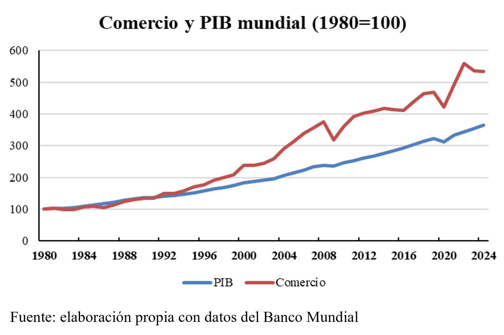
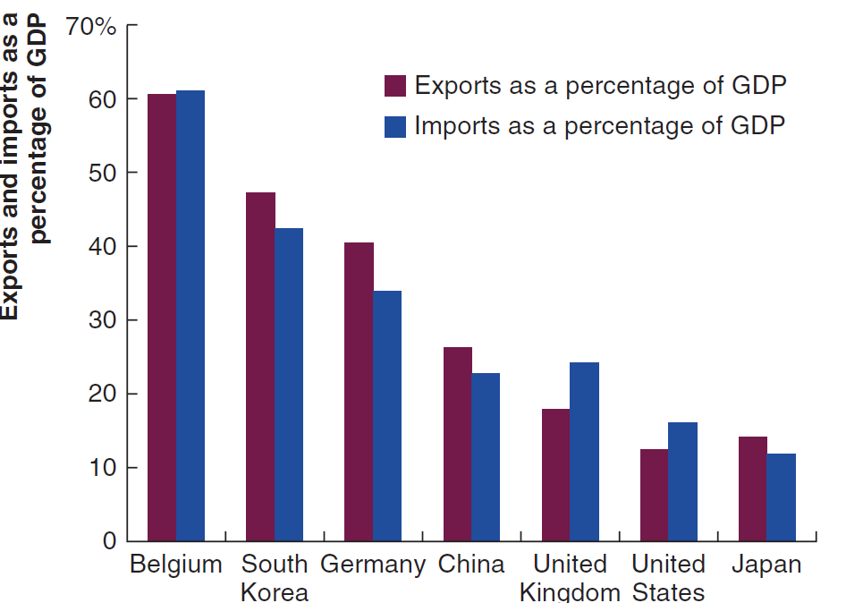
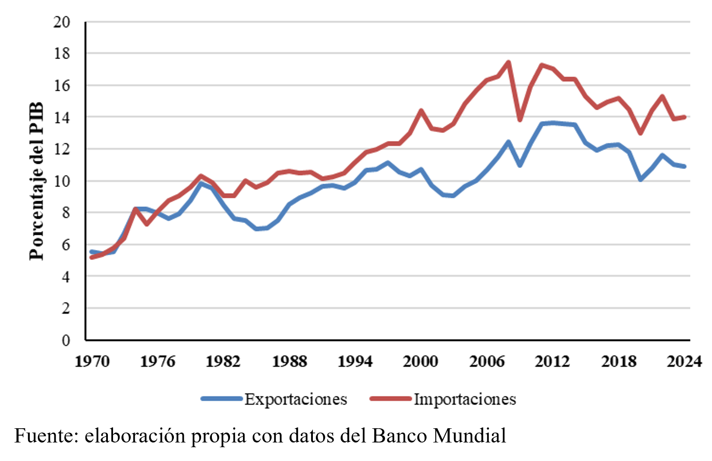
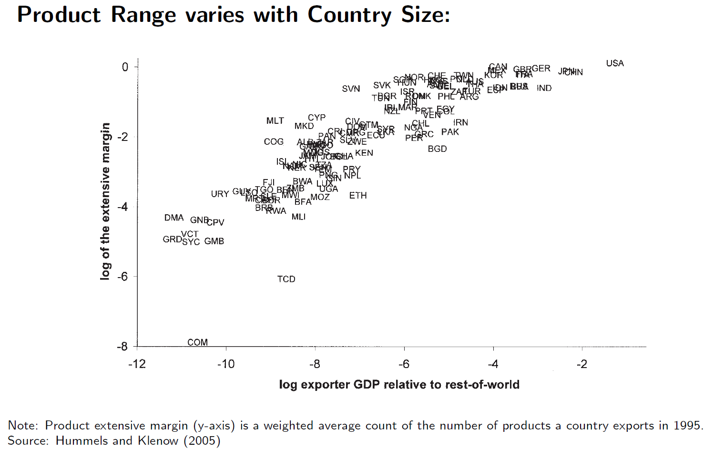
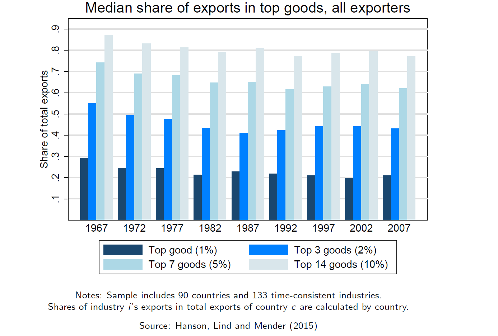
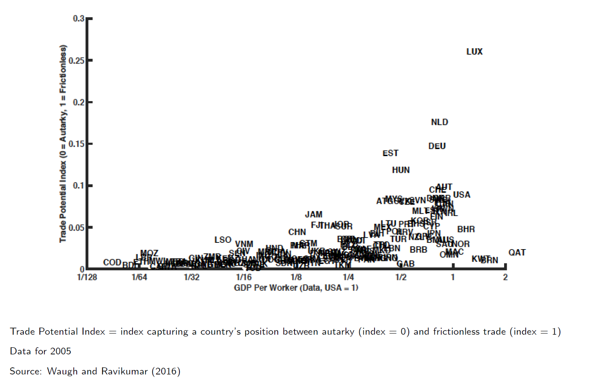
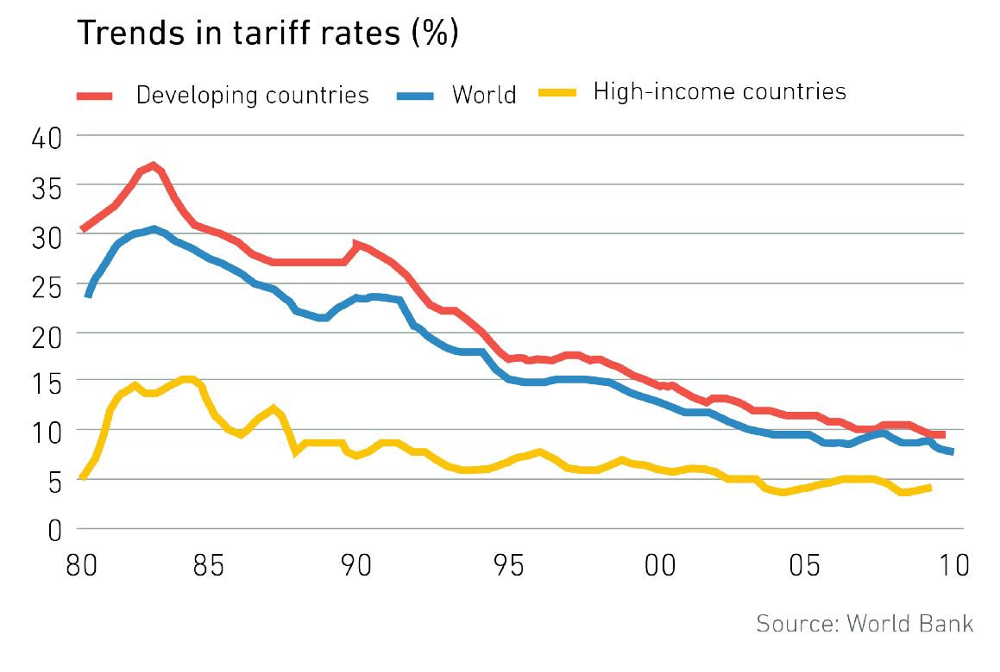

class: inverse, middle

```{r Setup, include = F}

library(pacman)
p_load(ggthemes, viridis, knitr, dslabs, gapminder, extrafont, Ecdat, wooldridge, tidyverse, magrittr)
options(htmltools.dir.version = FALSE)
# Define colors
red_pink <- "#e64173"
met_slate <- "#272822" 
turquoise <- "#20B2AA"
orange <- "#FFA500"
red <- "#fb6107"
blue <- "#2b59c3"
green <- "#8bb174"
grey_light <- "grey70"
grey_mid <- "grey50"
grey_dark <- "grey20"
purple <- "#6A5ACD"
slate <- "#314f4f"
# Notes directory
dir_slides <- "~/Lectures/01-Intro"
# Knitr options
opts_chunk$set(
  comment = "#>",
  fig.align = "center",
  fig.height = 7,
  fig.width = 10.5,
  warning = F,
  message = F
)  
opts_chunk$set(dev = "svg")
options(device = function(file, width, height) {
  svg(tempfile(), width = width, height = height)
})
options(crayon.enabled = F)
options(knitr.table.format = "html")
```

```{css, echo = F, eval = F}
@media print {
  .has-continuation {
    display: block !important;
  }
}
```

# Prólogo

---

# Objetivos del curso

<br>

Para esta clase nosotros:

--

* estudiaremos modelos que explican por qué los países comercian.

--

* analizaremos los efectos de las principales herramientas de política comercial (aranceles, cuotas, subsidios).

--

* exploraremos algunas teorías de las finanzas internacionales sobre el tipo de cambio y la BdeP.


---

# Naturaleza multidisciplinaria

<br>

```{r, echo=FALSE, out.width="95%"}

knitr::include_graphics("figures/trade_overlap.png")

```

---

# Plan del día
<br>

1. __Logística del curso__

1. Presentación

1. Hechos estilizados sobre el comercio internacional

1. Si el tiempo lo permite... repaso de los modelos tradicionales de comercio.

---

# Logística del curso

En este curso no tendremos un libro de texto obligatorio; sin embargo, la teoría y alguno de los ejemplos prácticos serán tomados de la siguiente bibliografía: 


* Gerber, James. (2023). _International Economics_ (8va ed.). Pearson .hi-pink[(JG)] 

* Feenstra, R. y Taylor, Alan. (2021). _International Economics_. MacMillan Learning. .hi-pink[(FT)]

* Feenstra, R. (2016). _International Trade. Theory and Evidence_ (2da ed.). Princeton University Press. .hi-pink[(RF)]

--

El contenido de este curso estará disponible en una página en Github en el futuro. 

---

# Contenido del curso

.pull-left[ *Contenido del curso:*
* .hi-slate[S1-S6:] Teoría del comercio 
* .hi-slate[S7-S8:] Política comercial
* .hi-slate[S9-S13:] Finanzas internacionales
]

.pull-right[ *Evaluación:*
* 25% - 5 Ejercicios prácticos
* 10% - 3 Controles de lectura
* 25% - Evaluación de un _working paper_
* 40% - Ensayo de investigación
]

---

# Plan del día

<br>

1. Logística del curso

1. __Presentación__

1. Hechos estilizados sobre el comercio internacional

1. Si el tiempo lo permite... repaso de los modelos tradicionales de comercio.

---

# Sobre mi


[**Emmanuel Anguiano**](https://eanguianopita.github.io)

- Posición actual: Investigador posdoctoral (SEHICITI-UdG)

- Previamente: Auditoría Superior del Estado de Jalisco, INDETEC y CONAFOR.

- Formación: (Economista)^3 😎

- Líneas de investigación: Economía Internacional, Macroeconomía, Desarrollo Económico y Econometría Aplicada

--

.hi-pink[¿Donde pueden encontrarme?]

- Asesorías virtuales: Escribir por correo electrónico 📧

- Correo: [.mono[javier.anguiano@cucea.udg.mx]](mailto:javier.anguiano@cucea.udg,mx) **(Usen curso de economía internacional como asunto del correo)**
---

# Presentación

- ¿A qué programa estás adscrito? 

- ¿Cuál es el tema de investigación de tu tesis doctoral? 

- ¿Por qué tomaste esta materia y que esperas del curso?

.center[]

---

# Plan del día

<br>

1. Logísitca del curso

1. Presentación

1. __Hechos estilizados sobre el comercio internacional__

1. Si el tiempo lo permite... repaso de los modelos tradicionales de comercio.

---

class: inverse, middle

# Comercio Internacional:

## Hechos estilizados

---

# Crecimiento del comercio y del PIB


```{r, out.width="85%", echo=FALSE}



```


En la última década se ha desacelerado el comercio ¿por qué? 
---
# Importancia relativa del comercio

```{r, echo=FALSE, out.width="75%"}



```

Las economías pequeñas y abiertas dependen del comercio
---

# Incremento en déficit de EEUU

```{r, out.width="80%", echo=FALSE}



```

¿El déficit comercial es bueno o malo para una economía?

---

# Hechos estilizados I

<br>

* La importancia del comercio se ha incrementado en el tiempo
* Los intercambios (flujos) representan una parte considerable del PIB
* La apertura comercial varía entre países de diferente tamaño

--

Surgen preguntas: 

* ¿Por qué los países comercian tanto y por qué está creciendo su importancia relativa? 
* ¿Cuáles son las ganancias o pérdidas del comercio?
* ¿Cómo se convierte el comercio en otros cambios (p.ej. resultados del mercado de trabajo, tensiones geopolíticas, propaganda, etc.)

--

En la .hi-slate[Parte I] de este curso nos enfocaremos en las .hi-slate[teorías del comercio internacional]. 

---

# Introducción a la teoría

<br>

Preguntas principales:

* ¿Qué bienes comercia cada país?

* ¿Cómo afecta el comercio a la especialización productiva?

---

# ¿Qué bienes comercia cada país?

```{r, echo=FALSE}



```

---

# Especialización y ventaja comparativa

```{r, echo=FALSE}



```


---

# Hechos estilizados II

<br>

* Los países se especializan y exportan sus productos principales.

* El intercambio de los bienes que los países producen con mayor *eficiencia* genera _ganancias del comercio_

--

¿Qué otros factores, además de los fundamentos macroeconómicos, influyen en la especialización?
--

- Inversión Extranjera Directa (IED)

- Difusión de tecnologías y conocimientos. 

- Choques migratorios. 

---

# ¿Por qué el comercio sigue creciendo? 

<br>

La razón principal es la reducción de las barreras al comercio. 

--

Nos referiremos a este proceso como .hi-slate[liberalización del comercio].

--

Algunos ejemplos incluyen la reducción de aranceles, acuerdos de comercio preferencial y eliminar las medidas no arancelarias (p.ej. disminuir la cuota de productos electrónicos importados por Francia desde E.E.U.U.)

--

__Dado que el comercio no es libre de fricciones, ¿varían estas fricciones entre países?__


---

# Índice de fricciones comerciales

```{r, echo=FALSE}



```

---

# Reducción en los aranceles

```{r, echo=FALSE}



```

---

# Reducción de los costos de transporte

```{r, echo=FALSE, out.width="80%"}

knitr::include_graphics("figures/8_freight_rates.png")

```

---

# Hechos estilizados III

<br>

* Las barreras comerciales han disminuido con el tiempo, coincidiendo con el crecimiento del comercio en relación con la actividad económica general. 

* Las barreras ocultas son el próximo obstáculo, y gran parte de la literatura sugiere que tienen un impacto mucho *mayor* que las tasas arancelarias actuales. 
--

---

# Panorama del curso

* Las teorías del comercio actuales y la literatura se enfocan en .hi-pink[modelos de agentes heterogéneos], los cuales fueron creados originalmente para explicar por qué no todas las empresas funcionan como exportadoras. 


* En este curso __no profundizaremos__ en los desarrollos teóricos más recientes. Sin embargo, puedo recomendar textos para aquellos que estén interesados en este tema. 

---

# Teoría del comercio internacional


.hi-pink[¿Por qué sucede el comercio?] Existen dos corrientes en la literatura especializada: 

--

__I. Modelos Neoclásicos de comercio __ (teorías 'viejas'):

- Modelo ricardiano: Diferencias tecnológicas impulsan el comercio.
- Modelo de Heckscher-Ohlin: Diferencias en recursos impulsan el comercio.

--

__II. 'Nueva' Teoría del comercio__

- Modelo de Krugman: El gusto por la *variedad* impulsa el comercio.
- Modelo de Melitz: La heterogeneidad de las empresas dirige el comercio ¿Por   qué unas exportan y otras no? 


---

# Siguiente clase 🔚

<br>

Empezaremos a estudiar la teoría del comercio internacional: .hi-pink[Modelo Ricardiano].

* Solo un factor de producción (trabajo)

* Modelo de dos países (Doméstico, Extranjero)

* Existen diferencias en la tecnología de los países. 

En adelante, intenta describir cada modelo usando tres atributos como los listados arriba y las principales conclusiones del modelo. 


---

# Siguiente clase 🔚

__Lecturas:__ 

* Gerber, J. (2023). _International Economics_. Pearson. Cap. 3. 

* Bernhofen, D., y Brown, J.C. (2004). A Direct Test of the Theory of Comparative Advantage: The Case of Japan. _Journal of Political Economy_, _112_(1), 48-67. https://doi.org/10.1086/379944 

* Bernhofen, D., y Brown, J.C. (2005). An Empirical Assessment of the Comparative Advantage Gains from Trade: Evidence from Japan. _American Economic Review_, _95_(1), 208-225.https://doi.org/10.1257/0002828053828491
---

exclude: true

```{R generate pdfs, include = F, eval = F}
#remotes::install_github('rstudio/pagedown')
library(pagedown)
pagedown::chrome_print("01-intro.html", output = "01-intro.pdf")
```
