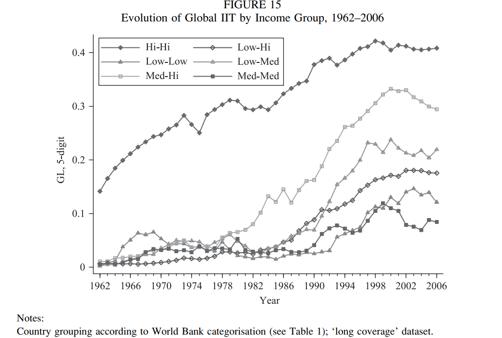
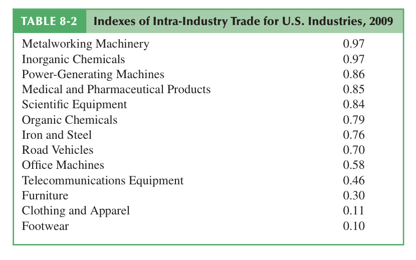
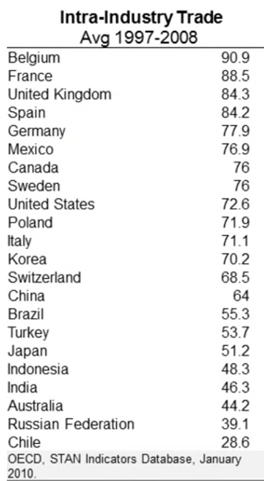
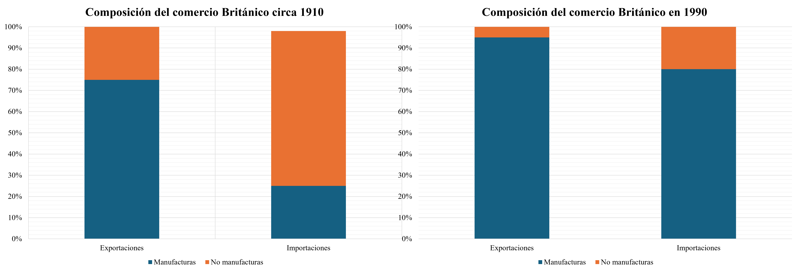
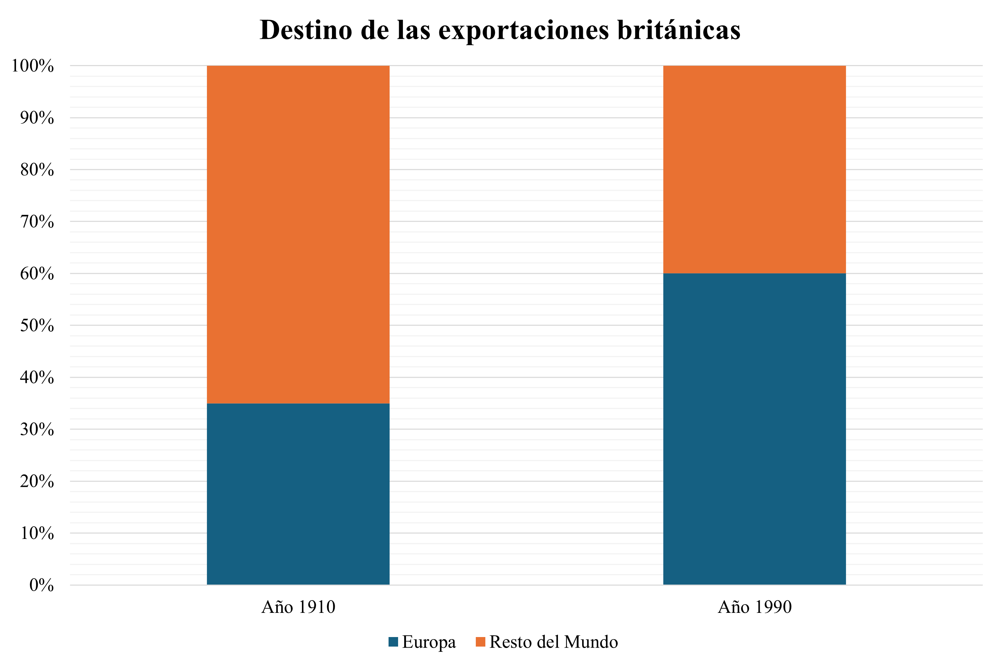
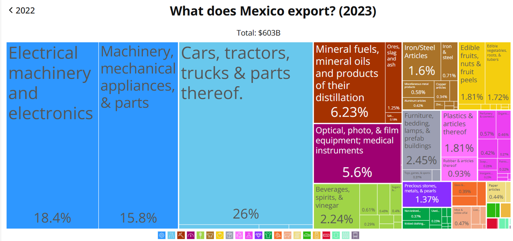
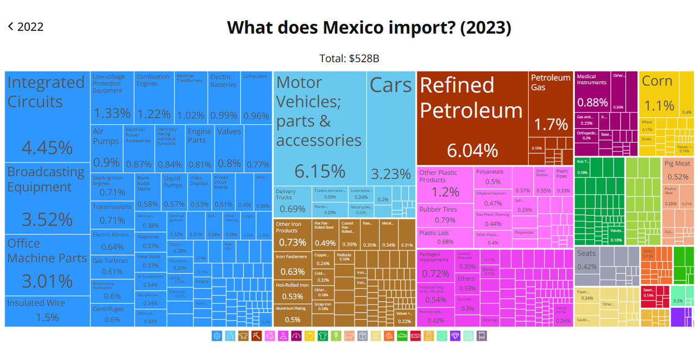

```{r Setup, include = F}
options(htmltools.dir.version = FALSE)
library(pacman)
p_load(ggthemes, viridis, knitr, dslabs, gapminder, extrafont, Ecdat, wooldridge, tidyverse, magrittr)
#devtools::install_github("R-CoderDotCom/econocharts")

library(econocharts)
# Define colors
red_pink <- "#e64173"
met_slate <- "#272822" 
turquoise <- "#20B2AA"
orange <- "#FFA500"
red <- "#fb6107"
blue <- "#2b59c3"
green <- "#8bb174"
grey_light <- "grey70"
grey_mid <- "grey50"
grey_dark <- "grey20"
purple <- "#6A5ACD"
slate <- "#314f4f"
# Notes directory
dir_slides <- "~/INVESTIGACION/POSDOC/Clase_Comercio Internacional/Código/Semana 2/"
# Knitr options
opts_chunk$set(
  comment = "#>",
  fig.align = "center",
  fig.height = 7,
  fig.width = 10.5,
  warning = F,
  message = F,
  echo = F
)  
opts_chunk$set(dev = "svg")
options(device = function(file, width, height) {
  svg(tempfile(), width = width, height = height)
})
options(crayon.enabled = F)
options(knitr.table.format = "html")
```

```{css, echo = F, eval = F}
@media print {
  .has-continuation {
    display: block !important;
  }
}
```


class: inverse, middle

.bigger[.center[.white[**Nuevas teorías del comercio internacional**]]]


---
# .smallest[Paradoja del comercio internacional]


.pull-left[
]

.pull-right[
]


.center[
Ventaja comparativa en el modelo ricardiano
]

---
# .smallest[Paradoja del comercio internacional]

.pull-left[
]

.pull-right[
]


.center[
Dotaciones factoriales en el modelo de Hecksher y Ohlin
]

---
# .smallest[Derribando el paradigma clásico]

.pull-left[

Exportaciones de EE.UU. a Japón
]

.pull-right[ <br>

Importaciones de EE.UU desde Japón
]


.center[.hi[¿Qué explica los patrones de comercio internacional?]]
 - Modelo ricardiano
 - Modelo de dotaciones (HO)

Ambos se basan en ventajas comparativas **interindustriales**


---
class: inverse, middle

.bigger[.center[.white[**Comercio intraindustrial**]]]

---
# Ejemplo de comercio intraindustrial 

.center[
]

---

# .smallest[Medición del comercio intraindustrial]

.pull-left[

* .hi[Definición]: Proporción del comercio internacional (exportaciones + importaciones) que tienen lugar *al interior* de la misma industria (entre países) en vez de entre industrias. 

* Medido por el .hi-purple[Índice de Grubel y Lloyd (GLI)]: 

$$ GLI = 1 - \frac{|X_i - M_i|}{X_i + M_i}$$
Donde $X$ son las exportaciones y $M$ son las importaciones de la industria $i$

.smallest[.source[Grubel, Herbert G. y Lloyd, Peter J. (1971). The Empirical Measurement of Intra-Industry Trade, *Economic Record*, Vol. 47, No. 4, pp. 494-517. [Descarga](https://doi.org/10.1111/j.1475-4932.1971.tb00772.x)]]

]

.pull-right[

   <br>

  
]

---
# Índice de Grubel y Lloyd (GLI)

.pull-left[
$$ GLI = 1 - \frac{|X_i - M_i|}{X_i + M_i}$$

* .hi-green[**Ejemplo**]: supongamos que un país exporta el bien $i$ pero no importa nada de dicho bien: 

$$GLI = 1-1 = 0$$
* No hay comercio intra-industrial; solo comercio interindustrial
]

.pull-right[
  


]

---
# Índice de Grubel y Lloyd (GLI)

.pull-left[
$$ GLI = 1 - \frac{|X_i - M_i|}{X_i + M_i}$$

* .hi-green[**Ejemplo**]: ¿qué sucedería si las exportaciones del bien  $i$ de un país $\approx$ a las importaciones del mismo bien?
$$GLI = 1- \frac{0}{X_i + M_i} = 1$$
* Únicamente .hi[existe comercio intraindustrial]; no hay comercio inter-industrial
]

.pull-right[
  


]

---
# Índice de Grubel y Lloyd (GLI)

.pull-left[
$$ GLI = 1 - \frac{|X_i - M_i|}{X_i + M_i}$$

* .hi[El GLI mide qué tan equilibrados están las exportaciones e importaciones de un país dentro de una industria específica]

 - Un valor cercano a 1 indica que el país exporta e importa en proporciones similares en una industria $i$. 
 - Un valor cercano a 0 indica que no se realizan operaciones entre industrias del mismo giro.
]

.pull-right[
  


]

---
# Índice de Grubel y Lloyd: Ejemplo

.pull-left[
$$ GLI = 1 - \frac{|X_i - M_i|}{X_i + M_i}$$

* .hi-green[**Ejemplo**]: En 2010, las importaciones de EE.UU de caña de azúcar tuvieron un valor de 1.9 mil MDD y el valor de las exportaciones fue de 170 MDD

$$GLI = 1 - \frac{|0.170 - 1.900|}{0.170 + 1.900} = 0.164 $$
 - Existió **poco** comercio intraindustrial

]

.pull-right[
  


]

---
# Índice de Grubel y Lloyd: Ejemplo

.pull-left[
$$ GLI = 1 - \frac{|X_i - M_i|}{X_i + M_i}$$

* .hi-green[**Ejemplo**]: En 2010, el valor de las exportaciones de EE.UU. en aeronaves fue de 1 mil MDD y el de las importaciones fue de 1.2 mil MDD

$$GLI = 1 - \frac{|1.000 - 1.200|}{1.000 + 1.200} = 0.909 $$
 - El comercio fue predominantemente **intra-industrial**

]

.pull-right[
  


]

---
# .smallest[El dilema de las similitudes en el comercio]

.center[]

.source[Brulhart, Marius, 2009, “An Account of Global Intra-industry Trade, 1962-2006,” *The World Economy* 32(2):401-459]


---
# .smallest[El dilema de las similitudes en el comercio]



.source[Krugman, Paul, Maurice Obstfeld, and Mark Melitz, 2011, *International Economics: Theory & Policy*, 9th ed., p.169]

---

# .smallest[El dilema de las similitudes en el comercio]

.center[]


.smallest[Proporción de IIT por país (más de 100%): suma en todas las industrias, poderando cada industria por su contribución al comercio total]

.source[Krugman, Paul., Obstfeld, Maurice., Melitz, Mark. (2011). *International Economics Theory & Policy*, 9 Ed., p. 169.]


---
# .smallest[El dilema de las similitudes en el comercio]

.center[]


.source[Krugman, Paul, 2008, “The Increasing Returns Revolution in Trade and Geography,” *Nobel Prize Lecture*]

---
# .smallest[El dilema de las similitudes en el comercio]

.center[]

.source[Krugman, Paul, 2008, “The Increasing Returns Revolution in Trade and Geography,” *Nobel Prize Lecture*]

---
# .smallest[.smallest[Las relaciones comerciales cambian en el tiempo]]

<iframe src="https://ourworldindata.org/grapher/merchandise-exports-by-continent?stackMode=relative&country=~USA" loading="lazy" style="width: 100%; height: 500px; border: 0px none;"></iframe>

---
class: inverse, middle

.bigger[.center[.white[**¿Qué exporta e importa México?** 🌮]]]
---

# ¿Qué *exporta* México?

.center[]

.source[Exportaciones de México: [MIT Observatory of Economic Complexity](https://oec.world/en/visualize/tree_map/hs92/export/mex/all/show/2023)]

---
# ¿Qué *importa* México?

.center[]

.source[Importaciones de México: [MIT Observatory of Economic Complexity](https://oec.world/en/visualize/tree_map/hs92/export/mex/all/show/2023)]


---

class: inverse, middle

.bigger[.center[.white[**Modelo gravitatorio del comercio**]]]

---

# Introducción

* Hemos estudiado diversos modelos de comercio, pero los resultados empíricos son **mixtos**:

--
 - Dificultades para identificar los bienes en los que se tiene una .hi[ventaja comparativa]
 
--
 - No es claro bajo que condiciones **se mantienen** las predicciones de la teoría (modelos ricardiano, FE y H-O)
 
--
 - Tenemos un mundo con muchos países y muchos bienes
 
--
<br>
<br>
 .center[.big[.big[¿Existen modelos de comercio que puedan ser respaldados con **evidencias empíricas**?]]]

---
# .samllest[El modelo gravitatorio de comercio]

.pull-left[

.smaller[

* Una forma relativamente **popular** para estimar el volumen de los flujos comerciales es el .hi[modelo gravitatorio del comercio]

* La idea es una analogía al modelo de atracción gravitacional de Isaac Newton 

$$F = G \times \frac{m_1*m_2}{r^2} $$ 
Donde: 
 - $F$ es la fuerza de atracción gravitacional.
 - $G$ es una constante gravitatoria. 
 - $m_i$ la masa de los objetos. 
 - $r$ la distancia entre el centro de la masa de los objetos.
]
]

.pull-right[ 

]


---
# .samllest[El modelo gravitatorio de comercio]

Jan Tinbergen (1962) incluyó una analogía física para introducir modelar los flujos bilaterales de comercio 

$$X_{ij} = e^{\beta_0}\frac{(Y_i)^{\beta_1}(Y_j)^{\beta_2}}{(D_{ij})^{\beta_3}}$$
Donde: 
 - $X_{ij}$ son las exportaciones del país $i$ al $j$
 - $e$ es una constante
 - $Y_i, Y_j$ el el PIB de ambos países
 - $D_{ij}$ es la distancia geográfica entre los países
 - Suponemos que $\beta_i$ son constantes. 


Existen problemas *técnicos* con la ecuación anterior

---
# Modelo gravitatorio de comercio

Para realizar las estimaciones econométricas comúnmente linealizamos el modelo usando logaritmos

$$log X_{ij} = \beta_0 + \beta_1 log( Y_i)+\beta_2 log(Y_j)-\beta_3 log(D_{ij})$$
Los coeficientes de este modelo pueden ser estimados fácilmente usando MCO 

--

* .hi[Regularidades empíricas]
 - El comercio bilateral aumenta con el tamaño económico de los socios. 
 - Sin embargo, el comercio disminuye con: 
   - Distancia
   - Barreras naturales y resistencias multilaterales (precios relativos y aranceles)
   - Idiomas distintos
   - Instituciones dispares (colonias, corrupción, religión, etc.)
   - Comercio doméstico
   
---
class: inverse, middle

.bigger[.center[.white[**Evidencias empíricas**]]]

---
# .smallest[.smallest[Flujos de comercio vs tamaño de los países]]

.center[]

.smallest[.source[Head, K., y Mayer, T. (2013). Gravity Equations: Workhorse, Toolkit, and Cookbook (CEPII Working Paper No. 27). Recuperado el 06 de octubre de 2025. [Enlace](https://cepii.fr/PDF_PUB/wp/2013/wp2013-27.pdf)]]

---
# .smallest[.smallest[Flujos de comercio vs distancia]]

.center[]

.smallest[.source[Head, K., y Mayer, T. (2013). Gravity Equations: Workhorse, Toolkit, and Cookbook (CEPII Working Paper No. 27). Recuperado el 06 de octubre de 2025. [Enlace](https://cepii.fr/PDF_PUB/wp/2013/wp2013-27.pdf)]]

---

# .smallest[McCallum (1995): Fronteras internacionales]

* McCallum (1995) estima el impacto de las fronteras internacionales en los flujos de comercio: 
 - Estudia los flujos de comercio entre las provincias de Canadá  y aquellos entre las provincias canadienses y los estados de EE.UU. 
 - Estima la siguiente regresión: 
 $$\log F_{ij} = \beta_0 +  \beta_1 \log Y_i + \beta_2 \log Y_j - \beta_3 D_{ij} + \beta_4 DUMMY_{ij}+ \varepsilon_{ij}$$

- $DUMMY_{ij}$ es igual a 0 para el comercio entre Canadá y EE.UU. y 1 para el comercio entre las provincias canadienses. 

- Los resultados de McCallum (1995) sugieren que $\beta_4$ es positivo y significativo
 - Esto implica que los flujos de comercio son significativamente más grandes al interior del país (No existe frontera)


---
# .smallest[McCallum (1995): Fronteras internacionales]

.center[]

.smallest[.source[McCallum, John. (1995). National Borders Matter: Canada-U.S. Regional Trade Patterns, *The American Economic Review*, Vol. 85, No. 3, pp. 615-623.  [Enlace](http://www.jstor.org/stable/2118191?origin=JSTOR-pdf)]]

---
# .smallest[McCallum (1995): Fronteras internacionales]

* Las estimaciones permiten a McCallum (1995) comparar el volumen de comercio que debería existir si no existiera una frontera (legal) entre Canadá y EE.UU. y los flujos reales

 - En **ausencia de fronteras**, Ontario y Quebec deberían exportar 10x más a California y no a Columbia Británica
 - Los **datos reales** muestran que Quebec y Ontario exportan 3x más a Columbia Británica que a California
 - En general, los resultados muestran que los flujos de comercio deberían ser hasta 22x más grandes (reduce 95%) si no existieran fronteras internacionales

.hi[Limitaciones]: 
  - El estudio considera el período antes del TLCAN (1988), existían algunos aranceles al comercio internacional entre Canadá y EE.UU. 
  - Los efectos estimados de las fronteras disminuyen a medida que lo hacen los aranceles, pero aún se mantienen 'altos'


---
# .smallest[McCallum (1995): Fronteras internacionales]

.center[]

.smallest[.source[McCallum, John. (1995). National Borders Matter: Canada-U.S. Regional Trade Patterns, *The American Economic Review*, Vol. 85, No. 3, pp. 615-623.  [Enlace](http://www.jstor.org/stable/2118191?origin=JSTOR-pdf)]]

---
# .smallest[McCallum (1995): Fronteras internacionales]

.center[]

.smallest[.source[McCallum, John. (1995). National Borders Matter: Canada-U.S. Regional Trade Patterns, *The American Economic Review*, Vol. 85, No. 3, pp. 615-623.  [Enlace](http://www.jstor.org/stable/2118191?origin=JSTOR-pdf)]]

---

class: inverse, middle

.bigger[.center[.white[**Modelos de comercio con gravedad**]]]

---
# Fundamentos teóricos

La formulación original del modelo gravitatorio de comercio de Jan Tinbergen (1962) no tenía detrás un fundamento teórico **sólido**

 - El modelo tiene una interpretación **intuitiva**, pero no existe ninguna razón teórica para que sus predicciones se cumplan a nivel empírico
 
--

Anderson y van Wincoop (2003) muestran que la ecuación gravitatoria de comercio se puede derivar de un .hi[modelo Armington]
 - En específico, muestran que un modelo ateórico como el de McCallum (1995) sufre de sesgos por variables omitidas. 
 - Al corregir el problema, los resultados sugieren un efecto mucho menor, aunque significativo, de las fronteras en los flujos de comercio internacional. 

---
# Modelo Armington 

* $i,j = 1,...,N$ países. Cada país produce un bien específico. 

* Los consumidores tienen preferencias tipo CES en los bienes y el ingreso $y_j$: 

$$U_j = \left(\sum_{i=2}^{N} (\beta_i) (c_{ij})^{\frac{\sigma}{1-\sigma}}\right)^{\frac{\sigma}{\sigma-1}}$$
.smallest[
Donde $\beta_{ij}$ ordena las preferencias (por país de origen) de consumo

$\sigma$ es la elasticidad de sustitución ($\sigma$ alta implica más facilidad de sustitución. Si es baja menos diferenciación) ]

.smallest[
Posibles casos de $\sigma$:  

 - Caso 1: $\sigma = 1$ Caso tipo Cobb-Douglas. El gasto es constante en ambos bienes y no depende de precios relativos. 
 - Caso 2: $0 < \sigma < 1$ (Baja sustitución). El gasto se modifica muy poco ante variaciones en los precios relativos. 
 - Caso 3: $\sigma = 0^{+}$. Bienes complementarios (Leontieff)
 - Caso 4: $\sigma > 1$ Bienes perfectamente sustitutos. Responde fuertemente a cambios en precios relativos. 

]
---

# Modelo Armington 

* Los precios de las exportaciones son iguales al precio doméstico multiplicado por un *costo de comerciar* ($t_{ij}$): 

$$p_{ij} = t_{ij}p_{i}$$

--

* Supongamos que existe un índice de precios CES ($P_j$ tal que $P_j U_j = I_j$): 
$$P_j = \left(\sum_{i = 1}^{N}(\beta_i t_{ij}p_i)^{1-\sigma} \right)$$

--

* El valor de las exportaciones del país $i$ al $j$ está dado por: ($x_{ij} = p_{ij}c_{ij})$

$$x_{ij} = \left(\frac{\beta_i t_{ij} p_{i}}{P_j}\right)^{1-\sigma}y_j$$

---
# Modelo gravitatorio

Podemos derivar la siguiente regresión para las exportaciones de $i$ desde $j$

$$x_{ij} = \frac{y_i y_j }{y^{W}}\left(\frac{t_{ij}}{P_i P_j}\right)^{1-\sigma}$$
.center[**Modelo estructural**]

--

Donde $y^{W} := \sum_{i=1}^{N}y_j$, que es .hi[muy similar] a la ecuación original del modelo gravitatorio

$$X_{ij} = G \frac{Y_i Y_j}{D_{ij}}$$
Adviértase que $D_{ij} = (t_{ij})^{\sigma -1}$ y $G = \frac{(P_i P_j)^{\sigma -1}}{y^W}$


.source[Anderson, James E., y van Wincoop, E. (2003). Gravity with Gravitas: A Solution to the Border Puzzle. *The American Economic Review*, *93*(1), p. 170-192 [DOI](https://www.aeaweb.org/articles?id=10.1257/000282803321455214)]

---
# .smallest[Implicaciones del modelo]

 Hay diversas implicaciones del modelo que acabamos de derivar $x_{ij} = \frac{y_i y_j}{y^W}\left(\frac{t_{ij}}{P_i P_j}\right)^{1-\sigma}:$
  - Las .hi[barreras al comercio internacional] reducen el comercio de forma diferenciada: 
   - Se reduce más entre países grandes que entre países pequeños. 
   - Incrementan más que proporcionalmente el comercio entre países pequeños en comparación con el de los grandes. 
   - Tienen efectos más .hi[grandes] en la medida en que se puedan sustituir la producción entre países. 
--

<br> 

* ¿Cuáles son los .hi[costos del comercio]? 
 - No son observables y deben estimarse de forma empírica  
$$t_{ij} = b_{ij} (d_{ij})^{\rho}$$

Donde $b_{ij}$ indica el arancel equivalente a la existencia de frontera entre $i$ y $j$. Nota que $b_{ij} = 1$ y $d_{ij}$ es la distancia entre los dos países. 


---
# .smallest[.smallest[Anderson y van Wincoop (2003): Resistencia al comercio]]

Estiman la siguiente regresión utilizando datos actualizados del comercio entre las provincias de Canadá y los estados de EE.UU.: 

$$\log z_{ij} := \log \left(\frac{x_{ij}}{y_i y_j}\right) = k + a_1 + \log d_{ij} + a_2 (1-\delta_{ij}) - (1-\sigma) \log P_i - (1-\sigma ) \log P_j + \varepsilon_{ij}$$
 - Los índices de precios son las variables que omitió el estudio de McCallum (1995)
 - En la práctica, los índices de precios no son CPI, sino que se estiman en conjunto con el modelo gravitatorio: 
 $$(P_j)^{1-\sigma} = \sum_{i=1}^{N} (P_i)^{\sigma -1} \theta_i e^{(a_1 \log d_{ij} + a_2 \log (1-\delta_{ij})}$$

Donde $\delta_{ij}$ es una variable dicotómica que distingue el comercio internacional del comercio doméstico. 

---
# .smallest[.smallest[Anderson y van Wincoop (2003): Resistencia al comercio]]

Al actualizar la ecuación considerando los **costos del comercio** á la Anderson y van Wincoop (2003) encuentran un efecto mucho menor de las fronteras en los flujos comerciales:

 - Los efectos de las fronteras dependen de un parámetro que mide la elasticidad del consumo (no está identificado). Lo estiman en aprox. $\sigma = 5$ (alto grado de sustitución)
 - Estiman dos modelos: 
   - Un modelo con dos países (Canadá y EE.UU)
   - Un modelo multi-país que permite estudiar los efectos del resto del mundo

* La existencia de fronteras **reduce** en 44% el comercio internacional. 
* Existen sesgos hacia el comercio doméstico. 

---
# .smallest[.smallest[Anderson y van Wincoop (2003): Resistencia al comercio]]

.center[]

.source[Anderson, James, E. y van Wincoop, E. (2003). Gravity with Gravitas: A Solution to the Border Puzzle. *The American Economic Review*, Vol. 93, No. 1, pp. 170-192 [Enlace](http://www.jstor.org/stable/3132167)]
 
---
# Distancia vs. costos de transporte

Asturias y Petty (2013) examinan la relación entre la distancia geográfica y el costo de envío puerto-puerto

 - Los resultados sugieren que no existe correlación entre ambos. 
 - Encuentran una correlación negativa entre los costos de envío (*shipping costs*) y los volúmenes de comercio
 - Los países que comercian **más** contratan más servicios de logística y emplean tecnologías más eficientes
 - Las ganancias del comercio debido a la liberalización del comercio se incrementan después de tomar en cuenta los costos endógenos de transporte

.hi[Interrogante]: ¿Por qué la distancia reduce los flujos de comercio?

---


# .smallest[Asturias y Petty (2013): Costos de transporte]
 
.center[]

.source[Asturias, José., y Petty, S. (2013). Endogenous Transportation Costs (Discussion Paper). University of Minnesota [Enlace]()] 
 
---

# .smallest[Asturias y Petty (2013): Costos de transporte]
 
.center[]

.source[Asturias, José., y Petty, S. (2013). Endogenous Transportation Costs (Discussion Paper). University of Minnesota[Enlace]()] 
 
---
# .smallest[Tamaño de los mercados de transporte]

.center[]

.source[Asturias, José., y Petty, S. (2013). Endogenous Transportation Costs (Discussion Paper). University of Minnesota[Enlace]()] 


* Los mercados **grandes**, además de estar en promedio más alejados: 
 - Tienen menores costos de transporte
 - Los servicios los realiza un mayor número de compañías
 - Los flujos de comercio son más grandes, en promedio y por compañía

---

class: inverse, middle

.bigger[.center[.white[**Zeros in Trade Data**]]]

---
# Introducción

Hasta ahora, nos hemos enfocado en estudiar ¿por qué comercian los países? 

* Muchos países realmente no comercian. 
* Es común ignorar los ceros, pero no existe una justificación clara. 

Dos preguntas adicionales
 - ¿De donde provienen los ceros? 
 - ¿Como los manejamos en las investigaciones empíricas? 

---
# .smallest[Uy (2015): Zeros and the Gains from Openness]

El estudio de Uy (2015) documento algunos hechos estilizados sobre los ceros en los datos

 - Existe un gran número de ceros, en la información sobre el comercio y la IED
   - 25% de los pares de países tienen cero comercio
   - Los ceros se asocian, principalmente, con economías muy pequeñas
   
En su análisis, muestra que considerar esos ceros afecta las estimaciones sobre las ganancias del comercio

 - Considera un modelo con comercio y IED para estimar los costos del comercio
 - La IED está sujeta a un mayor costo fijo, pero no a costos comerciales .hi[tipo iceberg]

---
# .smallest[Uy (2015): Zeros and the Gains from Openness]


.center[]

.hi-red[25% de las relaciones potenciales presentan comercio **cero**]

.source[Uy, Timothy. (2015). Zeros and the Gains from Openness, (Meeting Papers 1158), *Society for Economic Dynamics* [Enlace](https://red-files-public.s3.amazonaws.com/meetpapers/2015/paper_1158.pdf)] 


---
# .smallest[Uy (2015): Zeros and the Gains from Openness]


.center[]


.source[Uy, Timothy. (2015). Zeros and the Gains from Openness, (Meeting Papers 1158), *Society for Economic Dynamics* [Enlace](https://red-files-public.s3.amazonaws.com/meetpapers/2015/paper_1158.pdf)] 

.hi-red[Ponderando por el tamaño del PIB, 99% de las relaciones de los países **más grandes** que el promedio son diferentes de cero]

---
# .smallest[Uy (2015): Zeros and the Gains from Openness]


.center[]


.source[Uy, Timothy. (2015). Zeros and the Gains from Openness, (Meeting Papers 1158), *Society for Economic Dynamics* [Enlace](https://red-files-public.s3.amazonaws.com/meetpapers/2015/paper_1158.pdf)] 

---
# Gravedad con ceros

* ¿Por qué nos debería importar que existan ceros? 
 - Formas funcionales logarítmicas
 - No existe comercio o hay errores en los datos

* ¿Qué hacemos con los ceros en los datos? 
 - La práctica *estándar* es ignorarlos (no eliminarlos ⚠️)

* Soluciones más .hi[avanzadas]
 - Derivar un modelo de regresión que genere de forma endógena los ceros
 - Incluir costos fijos en los modelos de comercio (si el comercio es muy costos se generan ceros)
 - Añadir un término al modelo en logaritmos que contabilice los ceros que predice el modelo (dummy)

---

exclude: true

```{R generate pdfs, include = F, eval = F}
#remotes::install_github('rstudio/pagedown')
library(pagedown)
pagedown::chrome_print("08-gravity_model.html", output = "08-gravity_model.pdf")
```
